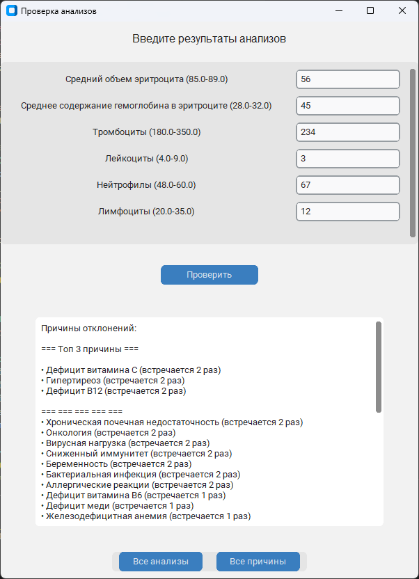
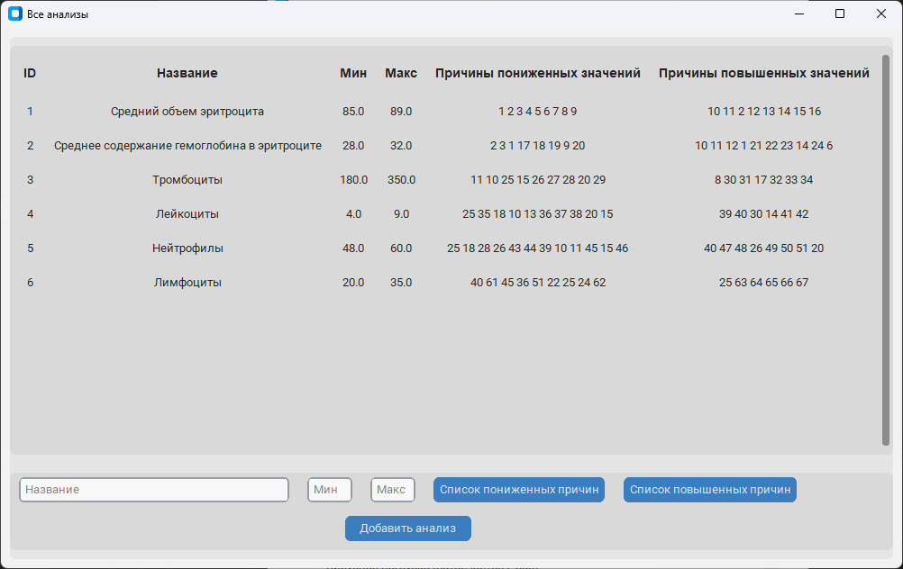
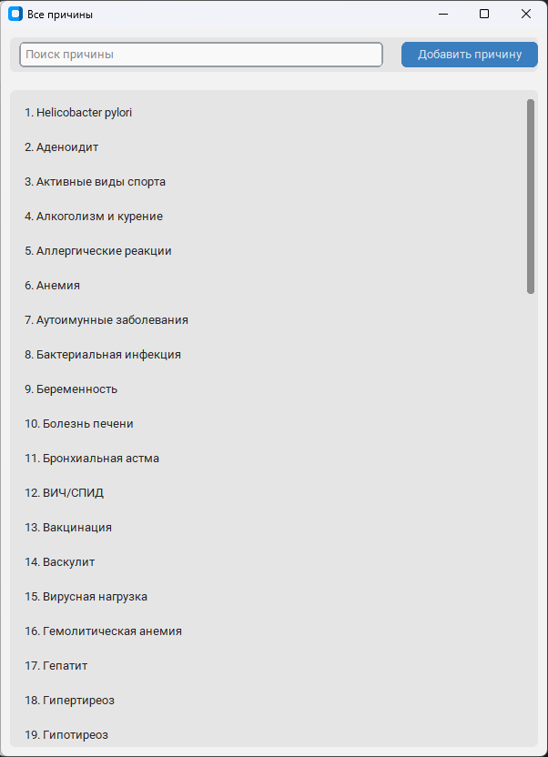

## ⚠️ Важное предупреждение

Этот проект создан в образовательных целях и не является медицинским приложением.

**НЕ ИСПОЛЬЗУЙТЕ** для постановки диагнозов или замены консультации с врачом.

Desktop-приложение для анализа медицинских анализов и выявления отклонений от нормы.


## Возможности

- **Ввод результатов анализов** - удобная табличная форма для ввода данных
- **Автоматический анализ** - сравнение показателей с нормальными значениями
- **Статистика причин** - определение наиболее частых причин отклонений
- **Управление базой данных** - добавление новых анализов и причин
- **Поиск и фильтрация** - быстрый поиск по анализам и причинам
- **Современный GUI** - красивый и интуитивно понятный интерфейс

## Установка и запуск

### 1. Клонирование репозитория
```bash
git clone https://github.com/Digmund/analyses_checkup.git
cd analyses_checkup
```

### 2. Установка зависимостей
```bash
pip install -r requirements.txt
```

### 3. Запуск приложения
```bash
python gui.py
```

## Сборка исполняемого файла
Для создания standalone версии:

```bash
pip install pyinstaller
pyinstaller --onefile --windowed gui.py
```
Исполняемый файл будет создан в папке dist/

## Архитектура проекта
```markdown
medical-analyzer/
├── gui.py              # Графический интерфейс
├── main.py             # Бизнес-логика анализа
├── database.py         # Работа с базой данных
├── analyze.db          # База данных (создается автоматически)
├── requirements.txt    # Зависимости
└── README.md          # Документация
```
## Использование
Основной workflow:
Запустите приложение - откроется главное окно с таблицей анализов

Введите значения в соответствующие поля

Нажмите "Проверить" - система проанализирует данные

Просмотрите результаты - топ причин отклонений и статистика

Управление базой данных:
"Все анализы" - просмотр и добавление новых анализов

"Все причины" - управление причинами отклонений

## Технологии
Python 3.8+ - основной язык программирования

CustomTkinter - современная библиотека для GUI

SQLite - база данных для хранения анализов и причин

CTkMessagebox - кастомные диалоговые окна

## Пример работы




## Структура базы данных
Таблица analysis:
analysis_id - ID анализа

analysis_name - название анализа

min_value - минимальное нормальное значение

max_value - максимальное нормальное значение

low_value_reasons - причины пониженных значений

high_value_reasons - причины повышенных значений

Таблица reasons:
id - ID причины

description - описание причины

## Автор
Dmitry - [\[GitHub\]](https://github.com/Digmund)
